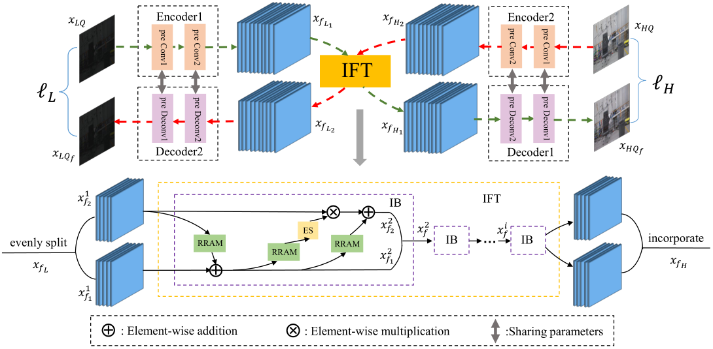
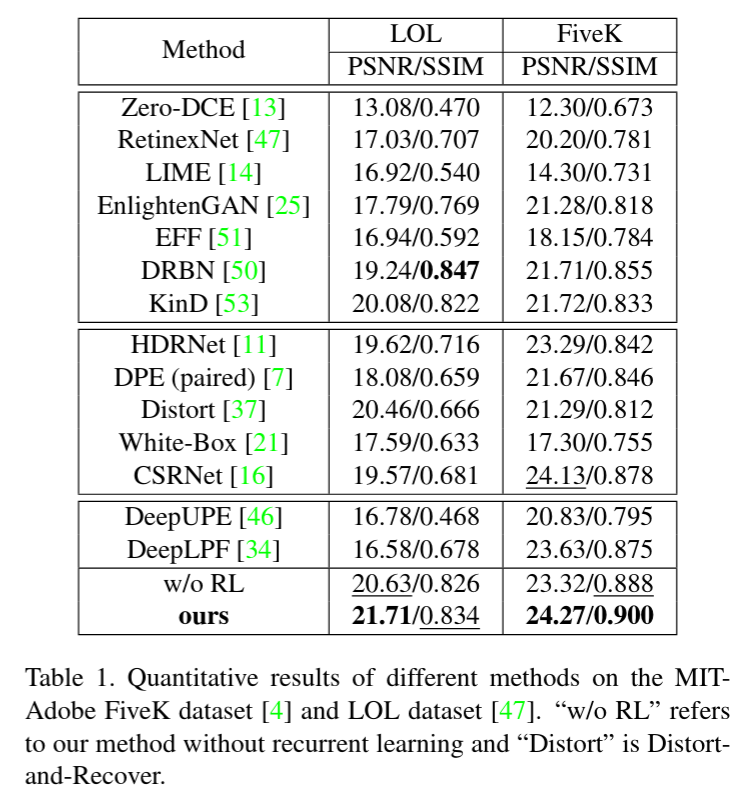
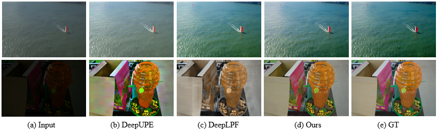
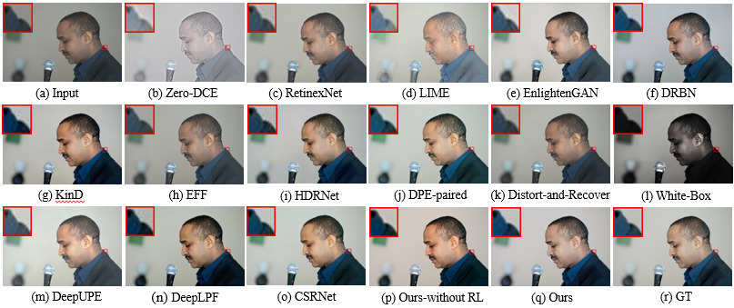
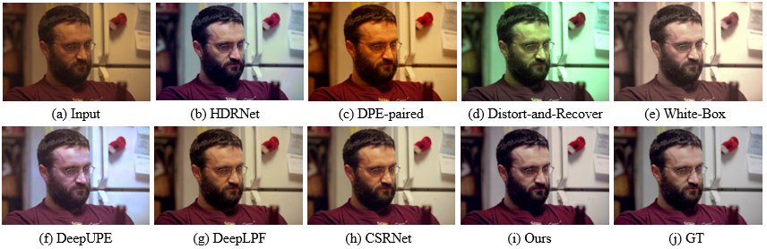
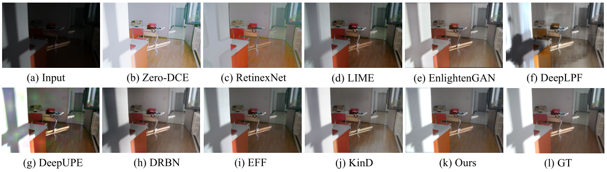

# Deep Symmetric Network for Underexposed Image Enhancement with Recurrent Attentional Learning (ICCV 2021)
This is the PyTorch implementation.

## Dependencies and Installation
- Python 3 
- [PyTorch >= 1.0](https://pytorch.org/)
  
## Dataset Preparation
- the MIT-Adobe FiveK dataset: the original dataset is in [link](https://data.csail.mit.edu/graphics/fivek/). We use the processed dataset from [DISTORT-AND-RECOVER-CVPR18](https://github.com/Jongchan/DISTORT-AND-RECOVER-CVPR18). The first 4,500 images and the last 500 images are used for training and testing respectively. 
- [the LOL dataset](https://daooshee.github.io/BMVC2018website/):  We use 400 pairs
for training and 100 pairs for testing.

## Get Started
```
cd codes
```

## Training
set the config file in options/train/, then run:
```
python train.py -opt options/train/train_for_fiveK.yml
python train.py -opt options/train/train_for_lol.yml
```
## Test
set the config file in options/test/, then run:
```
python test.py -opt options/test/test_for_fiveK.yml
python test.py -opt options/test/test_for_lol.yml
```

## The pretrained model
The pre-trained models for the two datasets are in codes/pretrained_model


## Architecture


## Quantitative Results
Quantitative evaluation results (PSNR / SSIM) of different methods on the two benchmark datasets. The images in the LOL dataset are in PNG format, while the images in the MIT-Adobe FiveK dataset are in JPEG format.



## Qualitative Results
The results of different methods on challenging images:


The visual results of different methods for the underexposed image in the MIT-Adobe FiveK dataset:


Comparison results with image retouching methods on the image in the MIT-Adobe FiveK dataset:


The results of low-light image enhancement methods on the image in LOL dataset:

## Acknowledgement
- The code is based on [BasicSR](https://github.com/xinntao/BasicSR) and [Invertible-Image-Rescaling](https://github.com/pkuxmq/Invertible-Image-Rescaling).
- The datasets are from [DISTORT-AND-RECOVER-CVPR18](https://github.com/Jongchan/DISTORT-AND-RECOVER-CVPR18) and [RetinexNet](https://daooshee.github.io/BMVC2018website/)
## Errata
- [DeepLPF: Deep Local Parametric Filters for Image Enhancement](https://github.com/sjmoran/DeepLPF)
- In the camera-ready of our ICCV paper, there are mistakes for the DeepLPF results in Fig. 1(c), Fig. 5(n), Fig. 6(g) and Tab. 1. The reason is that we trained 300 epochs with the batch size as 30 (we randomly cropped each image to 250x250 to set multiple batch sizes for training), while the original set is batch_size = 1. After the authors reminded us, we set the batch size to 1 and re-trained for 300 epochs to correct the results of the figures and tables in the paper.
- Here are the updated [PDF](https://www.shaopinglu.net/publications_files/ICCV21_Image_Enhancement.pdf) and [project page](https://www.shaopinglu.net/proj-iccv21/ImageEnhancement.html) of our paper.
## License
It is open source under BSD-3 license. Codes can be used freely only for academic or education purpose. If you want to apply it to industrial products, please send an email to Shao-Ping Lu at slu@nankai.edu.cn first.
## Citation
```
@InProceedings{Zhao_2021_ICCV,
    author    = {Zhao, Lin and Lu, Shao-Ping and Chen, Tao and Yang, Zhenglu and Shamir, Ariel},
    title     = {Deep Symmetric Network for Underexposed Image Enhancement With Recurrent Attentional Learning},
    booktitle = {Proceedings of the IEEE/CVF International Conference on Computer Vision (ICCV)},
    month     = {October},
    year      = {2021},
    pages     = {12075-12084}
}
```
## Contact
If you have any questions, please contact lin-zhao@mail.nankai.edu.cn.


